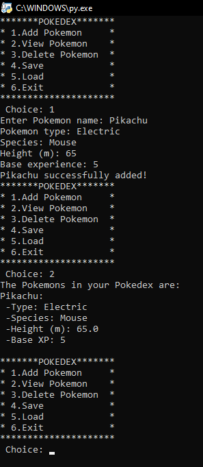

# Pokedex - Python Files + Dictionaries
### Freshman Laboratory Exercise
This is Pokedex, a system to  load from a file. save state, add, view, and delete pokemons inside the program. This is one of our Python laboratory exercises during my freshman year.

